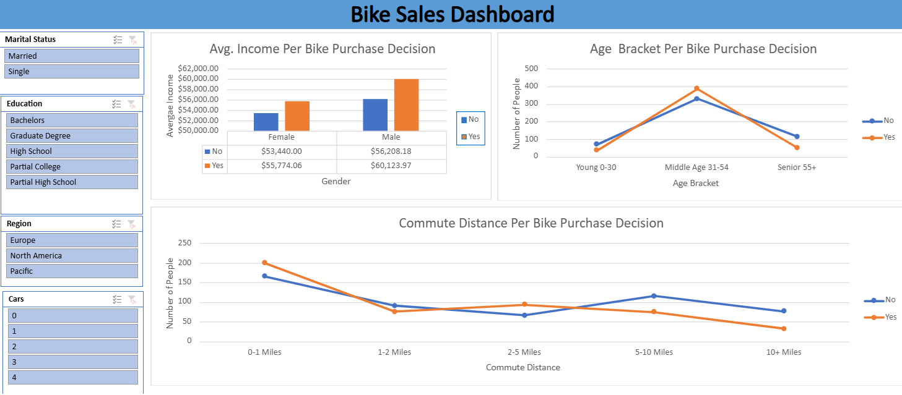

# 🚲 Bike Sales Analysis Dashboard — Excel Project

## 📌 Project Overview

This project analyzes bike purchasing behavior across **1,000+ customers** using Microsoft Excel.
The goal was to uncover what demographic and lifestyle factors influence a customer's decision to buy a bike. The analysis was done entirely in Excel — 
data cleaning, pivot tables, and an interactive dashboard with slicers.

---

## 📂 Dataset

| Column | Description |
|---|---|
| ID | Unique customer identifier |
| Marital Status | Married / Single |
| Gender | Male / Female |
| Income | Annual income in USD |
| Children | Number of children |
| Education | High School / Partial College / Bachelors / Graduate Degree / Partial High School |
| Occupation | Manual / Clerical / Skilled Manual / Professional / Management |
| Home Owner | Yes / No |
| Cars | Number of cars owned (0–4) |
| Commute Distance | 0-1 / 1-2 / 2-5 / 5-10 / 10+ Miles |
| Region | Europe / North America / Pacific |
| Age | Customer age |
| Purchased Bike | Yes / No (Target Variable) |

**Total Records:** ~1,028 rows

---

## 🛠️ Tools Used

- **Microsoft Excel** — Data Cleaning, Pivot Tables, Charts, Slicers, Dashboard

---

## 🔄 Process

1. **Data Cleaning** — Removed duplicates, standardized categorical values (M→Married, S→Single, etc.), handled blanks
2. **Feature Engineering** — Created Age Bracket column (Young 0–30, Middle Age 31–54, Senior 55+)
3. **Pivot Tables** — Summarized data by Gender, Age Bracket, and Commute Distance vs Purchase Decision
4. **Dashboard** — Built interactive dashboard with slicers for Marital Status, Education, Region, and Cars

---

## 📊 Dashboard

The dashboard contains three key charts:
- **Avg. Income Per Bike Purchase Decision** (by Gender)
- **Age Bracket Per Bike Purchase Decision**
- **Commute Distance Per Bike Purchase Decision**

Slicers: Marital Status | Education | Region | Cars

---

## 🔍 Key Insights

### 1. Income Drives Purchase Decisions
- Customers who bought a bike had **higher average income** across both genders
- Male bike buyers averaged **$60,123** vs $56,208 for non-buyers
- Female bike buyers averaged **$55,774** vs $53,440 for non-buyers
- **Higher income = higher purchase likelihood**

### 2. Middle-Age Customers Buy the Most
- The **31–54 age group** has the highest bike purchases (~375 buyers)
- Young customers (0–30) buy fewer bikes despite being physically active — likely due to lower income
- Seniors (55+) show the lowest purchase rate — bikes may not suit their lifestyle or mobility

### 3. Short Commuters Buy More Bikes
- Customers with **0–1 mile commute** are the top buyers (~200 purchases)
- Purchase likelihood drops sharply as commute distance increases
- At **10+ miles**, very few customers buy bikes — long commutes make bikes impractical

### 4. Non-buyers Dominate at Longer Commutes
- From 5–10 miles onward, **non-buyers outnumber buyers significantly**
- This suggests bikes are primarily seen as a short-distance or leisure purchase, not a long-haul commute solution

---

## 💡 Recommendations

| # | Recommendation | Based On |
|---|---|---|
| 1 | **Target middle-age, mid-to-high income customers** as the core buyer segment | Income + Age analysis |
| 2 | **Run marketing campaigns for short-commute urban neighborhoods** (0–2 miles) | Commute distance data |
| 3 | **Offer financing or budget models** to attract young (0–30) and lower-income segments | Income gap for young buyers |
| 4 | **Position bikes as fitness/leisure for seniors**, not commute tools | Low senior purchase rate |
| 5 | **Target single professionals** — they tend to have higher disposable income and fewer dependents | Marital status slicer patterns |

